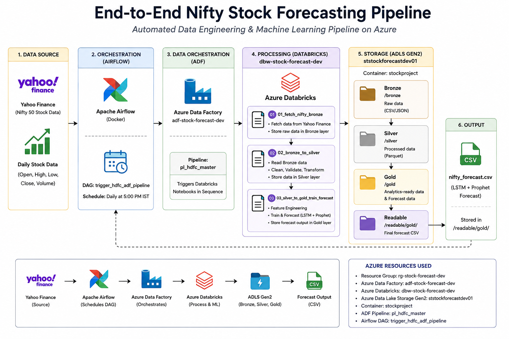
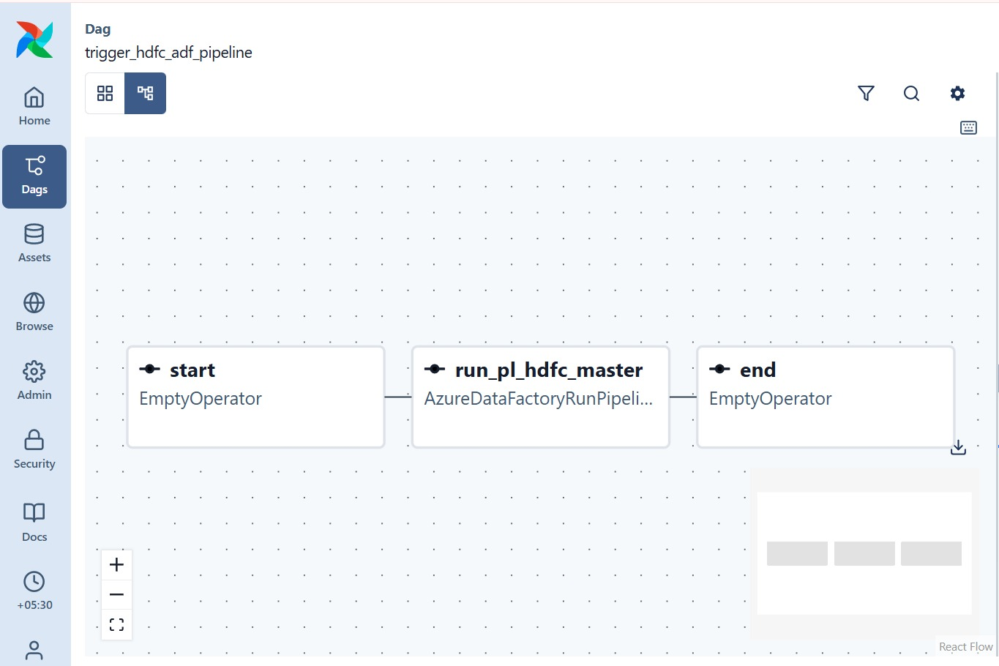
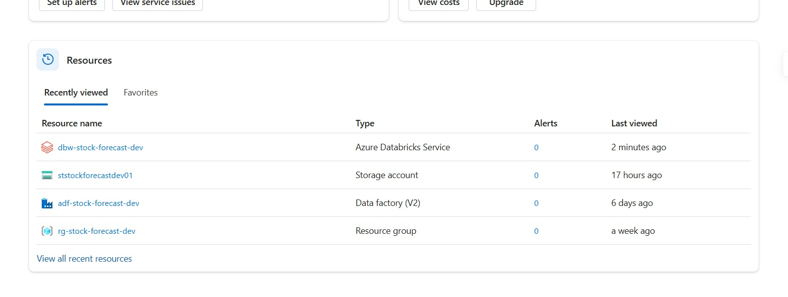
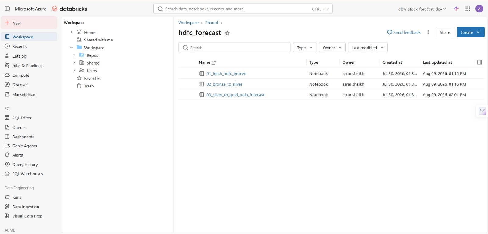
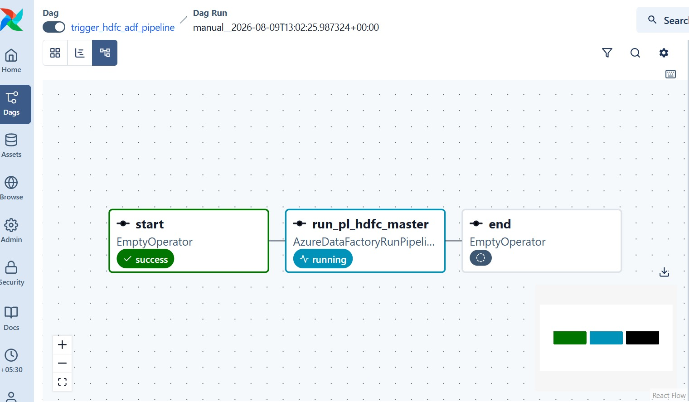
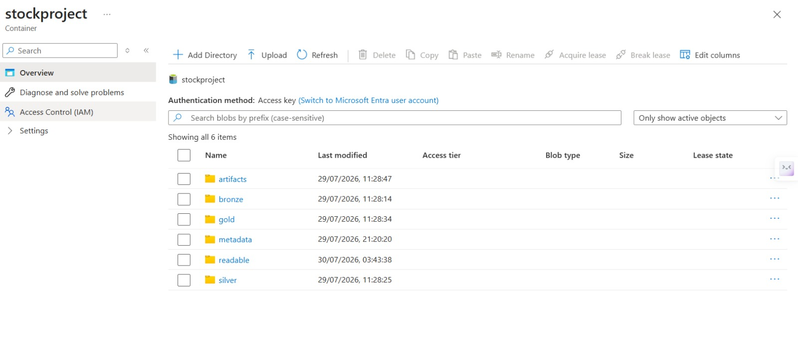
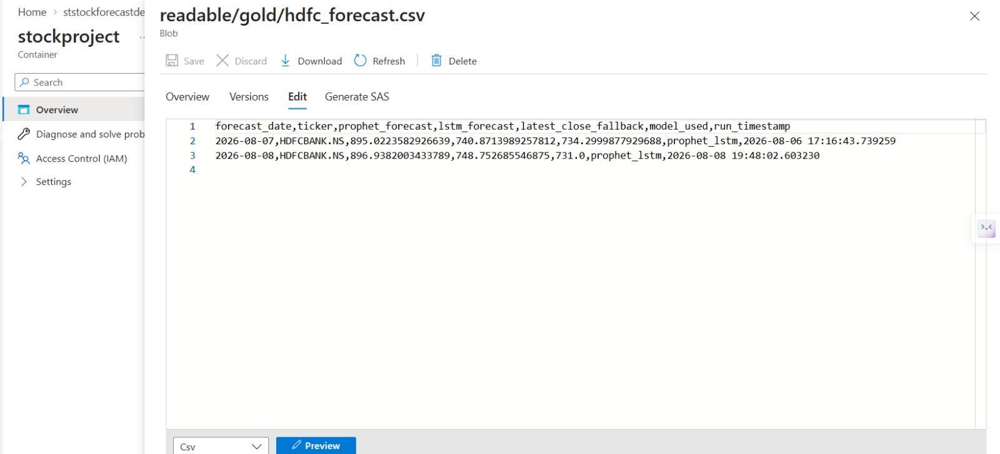

# End-to-End Nifty Stock Forecasting Pipeline

    

Automated end-to-end stock forecasting pipeline (currently configured for **HDFCBANK.NS**, extendable to any Nifty stock) using Apache Airflow, Azure Data Factory, Azure Databricks, and Azure Data Lake Storage Gen2, with LSTM and Prophet models following a Medallion Architecture.

## 📌 Project Overview

This project implements an automated cloud-based stock data engineering and forecasting pipeline.

The pipeline collects historical stock market data for HDFC Bank (HDFCBANK.NS), processes it through Bronze, Silver, and Gold layers using PySpark and Databricks, and generates stock price forecasts using LSTM and Prophet models.

The workflow is orchestrated using Apache Airflow and Azure Data Factory, while Azure Data Lake Storage Gen2 is used for data storage. The architecture is designed to be stock-agnostic — any Nifty-listed ticker can be plugged in with minimal configuration changes.

## 🏗️ Architecture

<p align="center">
  
</p>

Detailed architecture notes and diagrams are available in the [`Architecture`](Architecture) folder.

## ☁️ Azure Resources

| Resource | Name | Type |
|---|---|---|
| Resource Group | `rg-stock-forecast-dev` | Resource Group |
| Databricks Workspace | `dbw-stock-forecast-dev` | Azure Databricks Service |
| Data Factory | `adf-stock-forecast-dev` | Data Factory (V2) |
| Storage Account | `ststockforecastdev01` | ADLS Gen2 |

## 🗂️ Data Lake Structure

The `stockproject` container in ADLS Gen2 is organized as follows:

```
stockproject/
├── bronze/      → Raw HDFC stock data ingested from Yahoo Finance
├── silver/      → Cleaned & standardized data (PySpark)
├── gold/        → Feature-engineered, forecast-ready data
├── artifacts/   → Trained model artifacts
├── metadata/    → Pipeline metadata / watermark tracking
└── readable/    → Human-readable exports (e.g. forecast CSVs)
```

## 📓 Notebook Flow

Notebooks live in the `hdfc_forecast` Databricks workspace folder (see [`Databricks`](Databricks) for the exported notebooks):

1. `01_fetch_hdfc_bronze` — Fetches HDFC stock data via yfinance, writes to the Bronze layer
2. `02_bronze_to_silver` — Cleans, validates & standardizes data using PySpark, writes to Silver
3. `03_silver_to_gold_train_forecast` — Feature engineering, LSTM & Prophet training, writes forecast output to Gold

## 📊 Sample Forecast Output

`readable/gold/hdfc_forecast.csv`

| forecast_date | ticker | prophet_forecast | lstm_forecast | latest_close_fallback | model_used |
|---|---|---|---|---|---|
| 2026-08-07 | HDFCBANK.NS | 895.02 | 740.87 | 734.30 | prophet_lstm |
| 2026-08-08 | HDFCBANK.NS | 896.94 | 748.75 | 731.00 | prophet_lstm |

## 🔄 Pipeline Orchestration

The Airflow DAG `trigger_hdfc_adf_pipeline` (see [`Airflow/dags`](Airflow/dags)) runs three steps: `start` → `run_pl_hdfc_master` (triggers the Azure Data Factory pipeline via `AzureDataFactoryRunPipelineOperator`) → `end`. Each DAG run's task status (success / running) is tracked directly in the Airflow UI.

## 🚀 Getting Started

### Prerequisites
- Python 3.9+
- Azure subscription (ADLS Gen2, Data Factory, Databricks access)
- Apache Airflow (local or hosted)

### Setup
```bash
git clone https://github.com/vrushabh-78/End_To_End_Nifty_Stock_Forecasting_pipeline.git
cd End_To_End_Nifty_Stock_Forecasting_pipeline
pip install -r requirements.txt
```

### Configuration
1. Set up Azure credentials (ADLS Gen2 connection string / service principal).
2. Configure the Azure Data Factory pipeline (`adf-stock-forecast-dev`) to point to your data source.
3. Update Airflow connection variables for ADF and Databricks.
4. Import the DAG from `Airflow/dags` and trigger `trigger_hdfc_adf_pipeline`.

See the [`Docs`](Docs) folder for additional setup and configuration notes.

## 🖼️ Screenshots

| Airflow DAG Graph | Azure Resources |
|---|---|
|  |  |

| Databricks Notebooks | DAG Run (Success) |
|---|---|
|  |  |

| ADLS Gen2 Folder Structure | Gold Layer Forecast Output |
|---|---|
|  |  |

## 📈 Future Improvements
- Add hyperparameter tuning for LSTM
- Incorporate additional macroeconomic features
- Add CI/CD for automated model retraining
- Add unit tests for pipeline stages

## 📄 License
This project is licensed under the MIT License — see the [LICENSE](LICENSE) file for details.
